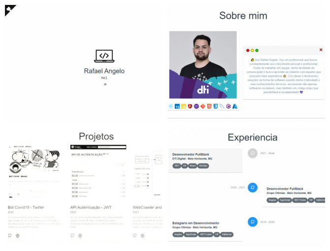

# Portifolio REACT (TS)



[Portifolio](https://rafaelangelo1999.github.io/portifolio-react-ts/) simples desenvolvido em REACT utilizando Typescript com o objtivo de aprensentar algumas informações importantes:
- [x] Sobre mim
- [x] Projetos
- [x] Experiencia

### Bibliotecas externas utilizadas
* [testing-library/react](https://www.npmjs.com/package/@testing-library/react) : Biblioteca de teste
* [story-book/react](https://www.npmjs.com/package/@storybook/react) : Biblioteca para documentação e testes de inteface dos componentes
* [@mui-material](https://www.npmjs.com/package/@mui/material) : Biblioteca de componentes personalizados

### Configuração do ambiente/constantes

No diretorio: ```src\utils\Constantes.ts``` existem algumas constantes de configurações para personalizar o portifolio.

```sh
export const PRESENTATION: IPresentation = {};
export const PROJETOS: IProject[] = [];
export const STACKS: IStack[] = [];
export const EXPERIENCESES: IExperiences[] = [];
```
### Comandandos scripts

##### `npm start`
Executa o aplicativo no modo de desenvolvimento.
Abra [http://localhost:3000](http://localhost:3000) para visualizá-lo no navegador.

A página será recarregada se você fizer edições.
Você também verá erros de lint no console.

##### `npm test`
Executa os tests da aplicação.
Os testes serão executados.
Você também verá erros/asserts no console.

##### `npm run storybook`
Executa o aplicativo no modo de visualização dos componentes.
Abra [http://localhost:6006](http://localhost:6006) para visualizá-lo no navegador.

A página será recarregada se você fizer edições.
Você também verá erros de lint no console.
    
##### `npm run deploy`
Executa o script de deploy da aplicação.
Você deve ter feito algumas configurações para conseguir publicar aplicação no seu servidor
### Atualmente publicado no [GitHub](https://rafaelangelo1999.github.io/portifolio-react-ts/)
